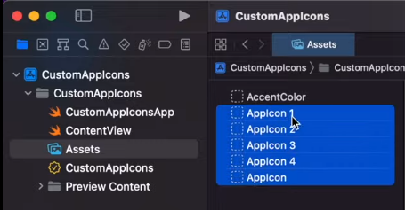
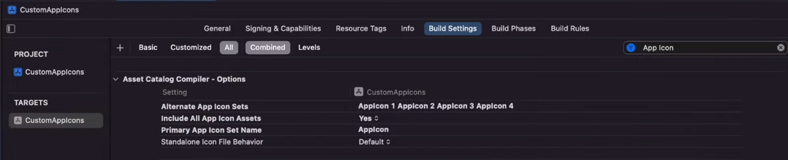

<p align="center"><br></p>
<h3 align="center">App Icon</h3>
<p align="center"><strong><code>@capacitor-community/app-icon</code></strong></p>
<p align="center">
  Capacitor community plugin for managing an app's icon. The main feature being that you can programmatically change the app icon.
</p>

<p align="center">
  
  <a href="https://www.npmjs.com/package/@capacitor-community/app-icon"></a>
<br>
  <a href="https://www.npmjs.com/package/@capacitor-community/app-icon"></a>
  <a href="https://www.npmjs.com/package/@capacitor-community/app-icon"></a>
  <a href="https://www.npmjs.com/package/@capacitor-community/app-icon"></a>
</p>

<p align="center"> </p>

## Maintainers

| Maintainer  | GitHub                                      | Social                                        |
| ----------- | ------------------------------------------- | --------------------------------------------- |
| John Borges | [johnborges](https://github.com/johnborges) | [@johnborges](https://twitter.com/johnborges) |

## Before Starting

> This plugin only changes the main app icon on the device homescreen. The icon in springboard and in other areas will not change and continue to show the original. (iOS)

> Changing the app icon is only allowed when the app is in the foreground (iOS).

> Android support is currently in beta. See the [android-support](https://github.com/capacitor-community/app-icon/tree/android-support) branch for more info.

## Installation

```bash
npm install @capacitor-community/app-icon
npx cap sync
```

## Configuration

The alternate icons need to be included within the app bundle and referenced in the project prior to using this plugin. It is not possible to switch to any icon on the fly without adding it to the project first. Below are the configurations steps for each platform.

## Android Configuration

### Add Alternate Icons

Add the alternate icons directly to your android project in `app/src/main/res`.

### Setup ApplicationManifest.xml

Each alternate icon is represented by an [`<activity-alias>`](https://developer.android.com/guide/topics/manifest/activity-alias-element). Add all the alternative icons to the `ApplicationManifest.xml` as child elements under `<application>`. The `name` attribute on `<activity-alias>` must be prefixed with dot `.` See [ApplicationManifest.xml](https://github.com/capacitor-community/app-icon/blob/android-support/example/android/app/src/main/AndroidManifest.xml) for full example.

```xml
<application>
    <!-- ... -->
    <activity
        android:name=".MainActivity"
        android:exported="true"
        android:launchMode="singleTask"
        android:configChanges="orientation|keyboardHidden|keyboard|screenSize|locale|smallestScreenSize|screenLayout|uiMode"
        android:label="@string/title_activity_main"
        android:theme="@style/AppTheme.NoActionBarLaunch">

        <intent-filter>
            <action android:name="android.intent.action.MAIN" />
            <!-- <category android:name="android.intent.category.LAUNCHER" /> -->
        </intent-filter>

    </activity>
    <activity-alias
        android:label="Stencil"
        android:icon="@drawable/stencil"
        android:roundIcon="@drawable/stencil"
        android:name=".stencil"
        android:enabled="true"
        android:exported="true"
        android:targetActivity=".MainActivity">
        <intent-filter>
            <action android:name="android.intent.action.MAIN" />
            <category android:name="android.intent.category.LAUNCHER" />
        </intent-filter>
    </activity-alias>
  
  <!-- additional <activity-alias> -->

<application>
```

## iOS Configuration

> Taken from https://www.youtube.com/watch?v=AT89ofYpWTU

### Create the alternate icons in assets catalog

In XCode go to Assets and create the App Icons.  
Then fill with images 1024x1024px



> The name of the asset should correspond to the name used in the code

### Change build settings

1. Visit Build Settings
2. Search For App icon,
3. Select "yes" for `Include All App Icon Assets`
4. Include a list (in `Alternate App Icon Sets`) with precise names of the app icons in the Assets Catalogue.



## Usage

```javascript
import { AppIcon } from '@capacitor-community/app-icon';

const changeIcon = async (iconName) => {
  await AppIcon.change({name: iconName, suppressNotification: true});
}

const getName = async () => {
  const { value } = await AppIcon.getName();
  console.log(value);
}

const resetIcon = async () => {
  const disable: string[] = ['stencil']; // all added aliaces names 
  await AppIcon.reset({ suppressNotification: true, disable });
}
```

## API

<docgen-index>

* [`isSupported()`](#issupported)
* [`getName()`](#getname)
* [`change(...)`](#change)
* [`reset(...)`](#reset)
* [Interfaces](#interfaces)

</docgen-index>

<docgen-api>
<!--Update the source file JSDoc comments and rerun docgen to update the docs below-->

### isSupported()

```typescript
isSupported() => Promise<{ value: boolean; }>
```

Checks if changing the app icon is supported. (iOS only)

**Returns:** <code>Promise&lt;{ value: boolean; }&gt;</code>

**Since:** 1.0.0

--------------------


### getName()

```typescript
getName() => Promise<{ value: string | null; }>
```

Gets the name of currently set alternate icon. If original icon is set, returns null.

**Returns:** <code>Promise&lt;{ value: string | null; }&gt;</code>

**Since:** 1.0.0

--------------------


### change(...)

```typescript
change(options: IconOptions) => Promise<void>
```

Changes app icon to specified alternate.

| Param         | Type                                                |
| ------------- | --------------------------------------------------- |
| **`options`** | <code><a href="#iconoptions">IconOptions</a></code> |

**Since:** 1.0.0

--------------------


### reset(...)

```typescript
reset(options: ResetOptions) => Promise<void>
```

Reverts app icon to original.

| Param         | Type                                                  |
| ------------- | ----------------------------------------------------- |
| **`options`** | <code><a href="#resetoptions">ResetOptions</a></code> |

**Since:** 1.0.0

--------------------


### Interfaces


#### IconOptions

| Prop                       | Type                  | Description                                                                       | Since |
| -------------------------- | --------------------- | --------------------------------------------------------------------------------- | ----- |
| **`name`**                 | <code>string</code>   | Name of alternate icon to set                                                     |       |
| **`disable`**              | <code>string[]</code> | Name of icons to disable. This is not used for iOS, but required for Android.     | 3.1.0 |
| **`suppressNotification`** | <code>boolean</code>  | Flag controlling the in app notification which shows after icon is changed. (iOS) |       |


#### ResetOptions

| Prop                       | Type                  | Description                                                                       | Since |
| -------------------------- | --------------------- | --------------------------------------------------------------------------------- | ----- |
| **`suppressNotification`** | <code>boolean</code>  | Flag controlling the in app notification which shows after icon is changed (iOS). |       |
| **`disable`**              | <code>string[]</code> | Name of icons to disable. This is not used for iOS, but required for Android.     | 3.1.1 |

</docgen-api>

## Contributors ✨

Thanks goes to these wonderful people ([emoji key](https://allcontributors.org/docs/en/emoji-key)):

<!-- ALL-CONTRIBUTORS-LIST:START - Do not remove or modify this section -->
<!-- prettier-ignore-start -->
<!-- markdownlint-disable -->
<table>
  <tbody>
    <tr>
      <td align="center" valign="top" width="14.28%"><a href="http://johnborg.es"><br /><sub><b>John Borges</b></sub></a><br /><a href="https://github.com/capacitor-community/app-icon/commits?author=johnborges" title="Code">💻</a></td>
      <td align="center" valign="top" width="14.28%"><a href="http://www.devdactic.com"><br /><sub><b>Simon Grimm</b></sub></a><br /><a href="https://github.com/capacitor-community/app-icon/commits?author=saimon24" title="Code">💻</a></td>
      <td align="center" valign="top" width="14.28%"><a href="https://github.com/chvonrohr"><br /><sub><b>Christian von Rohr</b></sub></a><br /><a href="https://github.com/capacitor-community/app-icon/commits?author=chvonrohr" title="Code">💻</a></td>
      <td align="center" valign="top" width="14.28%"><a href="https://qliq.dev"><br /><sub><b>QliQ.dev</b></sub></a><br /><a href="https://github.com/capacitor-community/app-icon/commits?author=qliqdev" title="Code">💻</a></td>
      <td align="center" valign="top" width="14.28%"><a href="https://hadouin.com"><br /><sub><b>Hadouin</b></sub></a><br /><a href="https://github.com/capacitor-community/app-icon/commits?author=hadouin" title="Documentation">📖</a></td>
    </tr>
  </tbody>
</table>

<!-- markdownlint-restore -->
<!-- prettier-ignore-end -->

<!-- ALL-CONTRIBUTORS-LIST:END -->

This project follows the [all-contributors](https://github.com/all-contributors/all-contributors) specification. Contributions of any kind welcome!
